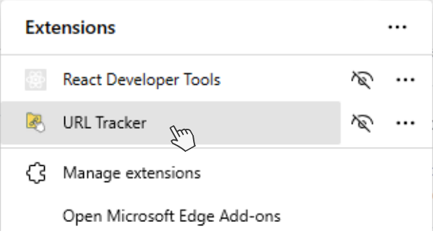
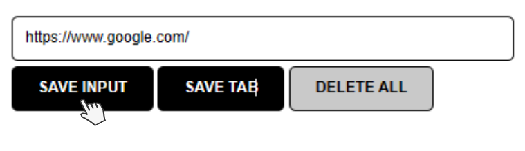

# URL Tracker Chrome Extension

The URL Tracker Chrome Extension is a handy tool that allows you to keep track of the URLs of the tabs you visit in your browser. It provides a simple interface to save and manage URLs, making it easy for you to revisit important resources and keep a history of your browsing sessions.

## Features

- Automatically captures and saves the URL of the current tab you are on.
- Allows manual input of URLs in the input space.
- Persists saved URLs even when you click off the extension, change tabs, or exit the browser.
- Provides a list view of the saved URLs for easy reference.

## Motivation

This extension was created to address the needs of individuals who tend to keep multiple tabs open and find it challenging to organize and track their browsing history. It is especially useful for learners who frequently explore new technologies and languages and want to keep a record of the resources they come across during their research.

## Installation

1. Clone or download the repository to your local machine.
2. Open the Chrome browser and go to `chrome://extensions`.
3. Enable the **Developer mode** toggle in the top right corner.
4. Click on the **Load unpacked** button and select the folder where you cloned or downloaded the extension.

## Usage

1. Click on the extension icon in the Chrome toolbar to open the URL Tracker.

2. To manually save a URL, enter it in the input space and click the **SAVE INPUT** button.

3. To save the URL of the current tab, click the **SAVE TAB** button.

4. To delete all saved URLs, double-click the **DELETE ALL** button.
5. You can click on any URL in the list to open it in a new tab.

